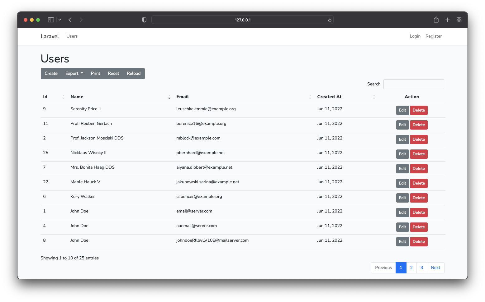

# Laravel with Datatable

[DataTables](https://datatables.net) is a table enhancing plug-in for the jQuery Javascript library, adding sorting, paging and filtering abilities to plain HTML tables with minimal effort. It is a highly flexible tool, built upon the foundations of progressive enhancement, that adds all of functionality without the need to write any JavaScript code.

Learn more about DataTables [here](https://datatables.net/).



## Getting started

```sh
# Fork this repository
# git clone <username>/datatables
cd datatables
cp .env.example .env
composer install
php artisan key:generate
touch database/database.sqlite
php artisan migrate
php artisan db:seed
php artisan serve
```

## Features

-   [x] Users Index page with Datatable
    -   [x] With Server-side processing and Ajax
    -   [x] Searching
    -   [x] Sorting
    -   [x] Paging
-   [ ] CRUD
    -   [ ] Create
    -   [ ] Read
    -   [ ] Update
    -   [ ] Delete
-   [ ] Tests
    - [ ] Authentication
    - [x] Users page with DT
    - [x] Users Model with date casting
-   [ ] Your feature

## Technology

-   Laravel v9
-   Laravel Datatables for Server side processing
-   jQuery
-   Styling: Boostrap v5

## Code quality

-   PHP Insights
-   PHP CS Fixer

## Testing

Using [Pest]() framework

```
php artisan test
```

## License

This project is licensed under the MIT license.
